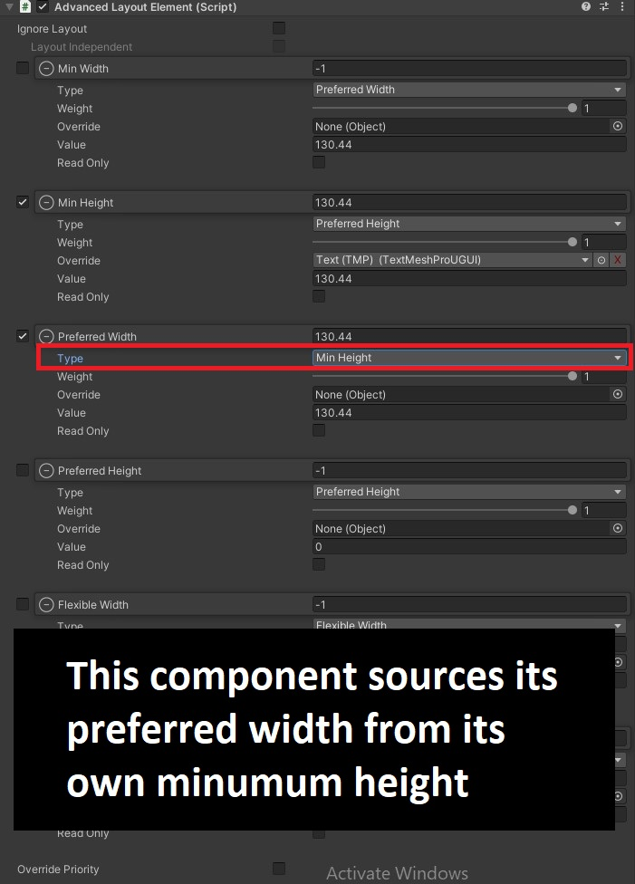

# advanced-layout-element

Warning: Documentation is in development. 
### Overview
The Advanced Layout Element is a simple component that aims to give you more control when setting up a UI layout. The main feature of the component is that it allows you to source a Rect Transfrorm's desired height or width from another component in your scene. While the Advanced Layout Element is usually used in combination with a Layout Group, the Advanced Layout Element can be made to act indepedently of any Layout Group. 

### Override Types
Since the main feature of this component is to use values from other objects. Here is how the override functions with different types.

- RectTransform
    - In the case of preffered or minumum properties the value will be retrieved from the transforms height or width respectively
    - In the case of flexible properties, it will retrieve the difference between the override's size and the element's size.

- Layout Element
    - Components that extends the ILayoutElement interface will use the same interface to retrieve desired values.

- TextMeshProUGUI
    - The text mesh pro text component extends ILayoutElement interface however the only the prefferred width or height seems to have relevant values

- Images or other Graphic Components
    - Graphic Components all extend ILayoutElement interface however the only the prefferred width or height seems to have relevant values

### Requirements
- This project was made using 2022.2.8f1 but the Advanced Layout Element should work in older versions. Let me know if you have issues

### Installation
Currently you can install this component by copying everything in the following directy directly into your own project.

    Assets/Scripts/AdvancedLayoutElement

Since this project is really just one component, I did not make the code into a package. I can make the code into a package upon popular demand.

### Known Issues

- Property values cannot be animated with the Unity Animator, it is recommended that you use a tweening library when animating UI. If there is demand I will consider adding this functionality.

### Accordian Menu Example
You can find an Accordian menu example located at:
    Assets/Scenes/AccordianDemo.Unity

In the Accordian demo each gameobject that utilizes the Advanced Layout Element is marked with a "*" in its name.

### Editor Example

### Script Example

    using System.Collections;
    using System.Collections.Generic;
    using UnityEngine;
    using AP.UI;

    public class SimpleToggle : MonoBehaviour
    {
        [SerializeField] bool m_IsEnabled;
        [SerializeField] RectTransform m_ArrowTransform;
        [SerializeField] AdvancedLayoutElement m_AnswerElement;

        //Called by a the OnClick event of a Button component
        public void Toggle()
        {
            m_IsEnabled = !m_IsEnabled;
        }
        

        void Start()
        {
            //Setting up the GUI elements to match the default enabled state.
            m_AnswerElement[LayoutProperty.PreferredHeight].Weight = m_IsEnabled ? 1 : 0;
            var angles = m_ArrowTransform.eulerAngles;
            angles.z = m_IsEnabled ? 0 : 90;
            m_ArrowTransform.eulerAngles = angles;
        }
        
        // Probably wouldn't modulate these values in update in a real app.
        // Would probably use a tweening library
        // but in a demo this is fine
        void Update()
        {
            var heightProp = m_AnswerElement[LayoutProperty.PreferredHeight];
            heightProp.Weight = Mathf.MoveTowards(heightProp.Weight, m_IsEnabled ? 1 : 0, .1f);

            var angles = m_ArrowTransform.eulerAngles;
            angles.z = Mathf.MoveTowardsAngle(angles.z, m_IsEnabled ? 0 : 90, 5f);
            m_ArrowTransform.eulerAngles = angles;
        }
    }

<Header><b>Quick Start</b></Header>

    Coming Soon

